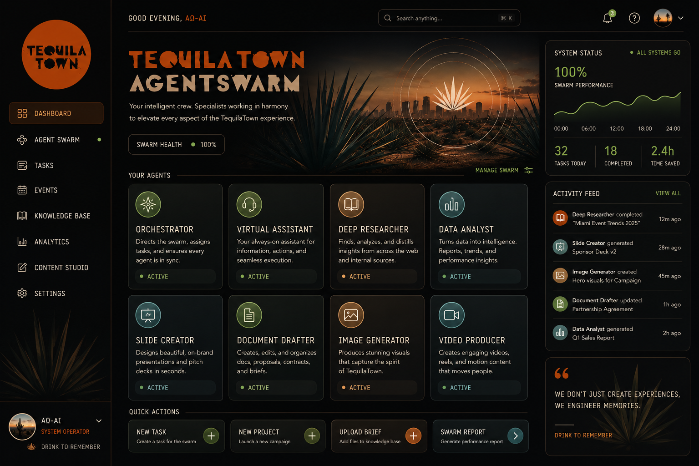

<div align="center">

# TequilaTown AgentSwarm

A modular AI operating system for TequilaTown Miami.



</div>

TequilaTown AgentSwarm coordinates specialized AI agents across guest experience, commerce, operations, analytics, sponsor intelligence, and creative execution for TequilaTown Miami.

TequilaTown is an immersive 25,000+ sq ft tequila experience in Miami with 10+ themed rooms, live art, architecture, music, and cultural storytelling.

## About

TequilaTown AgentSwarm is the AI command layer for TequilaTown Miami. It brings together a master orchestrator and specialized agents for guest support, ticketing, VIP upsells, sponsor intelligence, operations, research, documents, decks, images, and video so the event team can move faster while keeping every output on-brand.

The system is designed for real event workflows: helping guests find the right experience, supporting commerce and lead capture, surfacing operational insights, and producing sponsor-ready creative assets from one coordinated dashboard.

## Agent Roster

**Master Orchestrator**
Routes tasks, coordinates specialists, and unifies outputs.

**Guest Experience**
- AI Bartender: tequila, cocktails, tasting paths, and sponsor recommendations
- AI Chef: pairings, flavor notes, menu guidance, and dietary handling
- Tour Guide: wayfinding, floor navigation, station info, timing, and accessibility
- Cultural Storyteller: Mexico, agave, ritual, art, music, and tasting education
- Guest Concierge: FAQs, guest support, hospitality replies, and escalations

**Commerce and Conversion**
- Ticketing Agent: admissions, upgrades, packages, group sales, and Tixr support
- Merch and Bottle Sales: retail discovery, product support, and purchase guidance
- Passport and Missions: check-ins, QR scans, rewards, and guest progression
- CRM and Lead Capture: profiles, consent, preferences, and sponsor-safe data
- VIP Upsell Agent: premium experiences, reservations, and hosted offers

**Operations and Insights**
- Schedule Agent: programming, staffing, run-of-show, and event timing
- Analytics Agent: KPIs, dashboards, guest flow, revenue, sentiment, and forecasts
- Feedback Agent: surveys, ratings, complaints, and guest recovery actions
- Sponsor Intelligence: partner reporting, activation ROI, and recap insights
- Internal Ops Agent: SOP lookup, issue triage, shift handoffs, and team support

**Creative Studio**
- Research Agent: trend, competitor, category, and activation research
- Docs Agent: briefs, SOPs, recaps, plans, PDFs, Markdown, and DOCX
- Slides Agent: sponsor decks, sales decks, recap decks, and PPTX export
- Image Agent: campaign visuals, lifestyle images, ads, and art assets
- Video Agent: teasers, promos, social video, and recap clips

## TequilaTown Facts

- Website: https://www.tequilatownmiami.com
- Tickets: https://www.tixr.com/groups/tequilatown
- Venue: 4710 Northwest 37th Avenue, Miami, FL 33142
- Contact: hi@tequila.town, +1-786-797-0200
- Public hours from the website: Thursday through Sunday, 6:00 PM to 11:00 PM Eastern
- Instagram: https://www.instagram.com/tequilatownmiami/

## Setup

Install the TequilaTown AgentSwarm package from this repository:

```bash
npm install github:Blocpod/TequilaTownAgentSwarm
npx tequilatown-agentswarm
```

For local development from a checkout:

```bash
npm install
```

Create the environment file:

```bash
cp .env.example .env
# Add at least one model provider key:
# OPENAI_API_KEY, ANTHROPIC_API_KEY, or GOOGLE_API_KEY
```

Run the local swarm directly:

```bash
python swarm.py
```

For API mode:

```bash
python server.py
```

The web dashboard opens at `http://127.0.0.1:8080/`.

## Dashboard

The TequilaTown AgentSwarm dashboard is committed at `assets/tequilatown/dashboard-mockup.png`.

## Project Status

The current audit and remaining production work are tracked in `docs/PROJECT_AUDIT.md`.

## License

This is proprietary software for authorized TequilaTown and Blocpod work. See `LICENSE`.

## Optional Supabase Layer

The repo includes `supabase/migrations/001_tequilatown_agent_swarm.sql`, a starter schema for agent events, guest profiles, tickets, mission progress, purchases, feedback, sponsors, activations, ops issues, content assets, and schedule blocks.

The migration enables RLS on public tables and grants baseline table/sequence access to `anon` and `authenticated`. Policies are intentionally conservative; tune them before production based on the actual guest app, staff app, and service-role flows.
